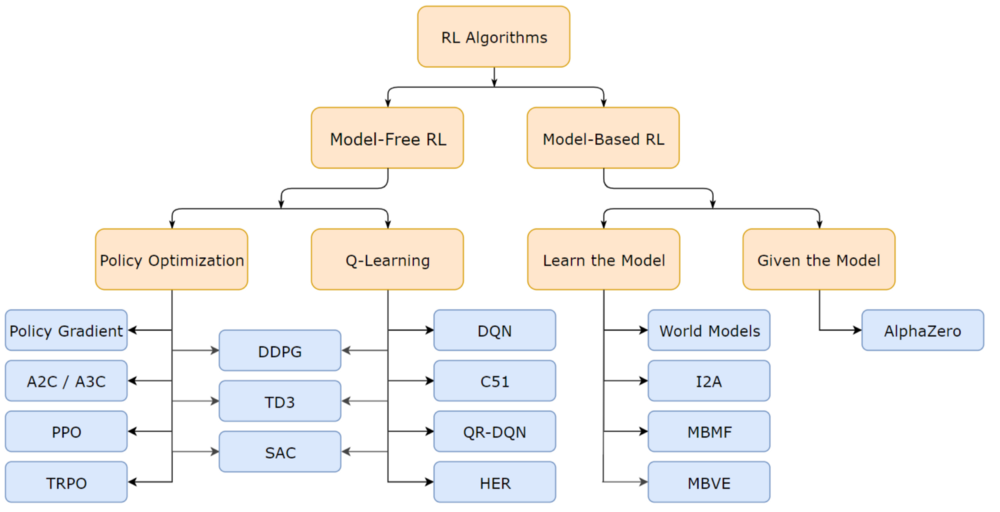

## Breakthrough in the world of Reinforcement Learning
In 2013, a company named **DeepMind**, acheievd a breakthrough in the world of Reinforcement Learning. They built a system that could learn to play many classic Atari games better than Humans.
Libraries like OpenAI gym and Keras have made it really easy to implement the DeepMind's algorithms. 

# ``Supervised`` & ``Unsupervised Learning`` & ``Reinforcement Learning``
- Supervised & Unsupervised Learning -> Learning from data 
- Reinforcement Learning -> learn from the environment

> Supervised Learning: we have the input data & the output we want. We build the model based on these 2 things

# When to Implement RL
1. No data to train on
2. we can assign a meaningful number to both positive and negatice outcomes
3. It is possible to simulate the environment 
4. Analytical solution too expensive to compute or impossible
5. More than one solution

## To implement Reinforcement learning to a problem we need to have some things:
- Define the Goal
- Know your environment
- Define a set of possible actions in this space
- Define the Rewards, which would be +ve if goal is achieved and negative for failure.
#### Note: Even when the envoronment is unknown, RL can be implemented

# Stochastic vs Deterministic Environment
A **Deterministic environment** is the one where a particular states leads to a fixed particular output state at all timesteps, whereas a **stochastic environemnt** is one where a certains state might not necessarily lead to a particular state, thus there is a probability for ending in a particular state.

# Understanding with an environment of Tic-Tac-Toe
Tic-tac-toe, is one such game, which we all have played. Lets start with this example. 
- A tic-tac-toe, has 9 positions to us to take an **action**. We want the model to understand the situation and act accordingly
- Each possible combination in the game will be a different situation. The actions will be different based on these situations.
- Once we know the state, we have to choose an action(or the best action, to win the game, known as **policy**)
- Taking this action will lead us to another situation, or new state. Based on the quality of the action taken, a **reward** is given.
- Here we want to take an **action** which increases our chances to win the game, and decreases the chances of the opponent to win the game.

# Reinforcement Learning Taxonomy 

## Value Based Methods

- [Q-Learning]()
- Deep Q-Learning
    - [First Solve]()
    - [All Solve]()

## Policy Based Methods

- [Hill Climbing]()
    - [Steepest Ascent]()
    - [Adaptive Noise Scaling]()
    - [Simulated Annealing]()
- Policy Gradient Methods
    - [Gradient Ascent]()
    - [REINFORCE]()

# Model Free vs Model- Based RL:
1. **Model-Free** :\
 It is an unductive approach, for solving problems. In this case model randomly performs in the environment. Then collects this data, known as experience. As this experience grows, the model gets a better idea about the rewards of an action. This approach uses past experience as empirical evidence and uses frequency statistics to estimate the value of its action.
- Rely on trial and error to update its knowledge

2. **Model-Based** :\
It is a deductive approach for solving problems. In this case we have a better understanding about the transition probabilities, and we use this model to derive the best actions and the optimal policy.
In this case, the agent can predict the dynamics of the environment as it has the estimate of the transition function. 
- They have Hard rules for the game

#### Examples:
- Algorithms that purely sample from experience such as Monte Carlo Control, SARSA, Q-learning, DQN, Actor-Critic are **model free** RL algorithms. They rely on real samples from the environment and never use generated predictions of next state and next reward to alter behaviour (although they might sample from experience memory, which is close to being a model).

- Q-Learning Algorithm:
$$Q(S_t,A_t) <- Q(S_t,A_t) + \alpha(R_t+1 + \gamma*maxQ(S_t+1,a)-Q(S_t,A_t))$$
as we see here that probablities of MDP are not used here, hence Q-learning is model-free algorithm
- Policy Improvement Algorithm
$$Q(s,a) <- P(s',r| s,a)(r+ \gamma*V(s'))$$
A probability defined by the MDP model is used here. Hence policy Iteration is Model-bases algorithm

> **Note**: If we don't have an accurate model provided as part of the problem definition, then model-free approaches are often better to use.

## On policy vs Off Policy
1. On Policy: In this, the learning agent learns the value function according to the current action derived from the policy currently being used.
1. Off Policy: In this, the learning agent learns the value function according to the action derived from another policy.

# Value Based vs Policy Based
1. In ``Policy-based`` methods we explicitly build a representation of a policy (mapping π:s→a) and keep it in memory during learning.
1. In ``Value-based`` we don't store any explicit policy, only a value function. The policy is here implicit and can be derived directly from the value function (pick the action with the best value).

## Policy
It is the **strategy** which decides the behavious of the agent. It specifies which actions to take in a particular state.It is denoted by $\pi$. \
It is a function, when given a current state in environment, it outputs and action, or a probability distribution over actions (if the policy is stochatic) to execute. The **optimal Policy** is the one which, if followed will make the agent collect the largest amount of rewards in the longer run. Thus we always want to find these optimal policy or policies.
- In MDP's there is always an **optimal deterministic polucy** that is better than any other policy, even if the MDP is non deterministic

# Markov Decision Process (MDP)
MDP, is one of the frameworks for solving Reinforcement Learning problems.
A Markov Decision Process contains a tuple of (S,A,R,P, $\gamma$)  :
- A set of possible world states, **S**. There can be continuous or finite states.
- A set of possible actions, **A**
- A real valued reward function **R(s,a)**. It can be positive or negative reward
- Transition Probability, **P** of ending in a state, s', after taking an action in "a", from state "s"
- $\gamma$ is the discount factor in range of (0,1)

A **Markov property** states that the probablity of being a in a state depends only on the previous state. \
In RL environment, the response at time, "t+1" is dependent only on the state and actions at time, "t" and independent of what happened in past.
$$P(S_t+1 |S_t) = P(S_t+1 | S_1,S_2,S_3...S_t)$$

## Credit Assignment Problem

### Different Open source libraries for RL 
1. Tensorflow RL Agents
2. OpenAI Baselines
3. Stable Baselines
4. Tensorforce
5. KerasRL

## Medium Article 
[Medium Article](https://adabhishekdabas.medium.com/rl-world-3fc4dc38a73d)